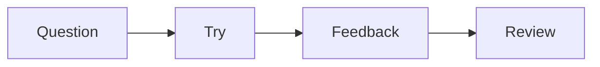

# LessonMark

[](https://github.com/ozekihiroshi/moodle-mod_lessonmark/actions/workflows/moodle-plugin-ci.yml)
[](LICENSE)

LessonMark turns Markdown into Moodle teaching material with **Mermaid
diagrams, LaTeX and AsciiMath formulas, code examples, self-check exercises,
and classroom presentations**. Write and preview in Moodle, reuse existing
Markdown, and keep the lesson source editable and portable.

- **Diagrams from text:** describe a process with Mermaid and preview the diagram.
- **A choice of math notation:** write LaTeX or the more approachable AsciiMath,
  inline or in a displayed block; use **Copy LaTeX** to reuse rendered formulas.
- **One source for reading and teaching:** use the saved lesson as a reading
  page or slides, and present lessons continuously across a course in 0.3.
- **Easy reuse:** paste Markdown source, import/export `.md` files, and retain
  editable formula and diagram notation instead of flattening it into images.

It is designed for technical and text-rich lessons that should remain easy to
review, translate, compare in Git, generate with authoring tools, and reuse
outside one Moodle database. Teachers can still create and maintain the whole
resource in Moodle without requiring Git, an external editor, Composer, or
Node.js on the server.

The plugin component is `mod_lessonmark`, targeting Moodle 5.2 on PHP 8.3 and 8.4.

| Download | Status |
| --- | --- |
| [**Newest prerelease: 0.3.0-alpha5**](https://github.com/ozekihiroshi/moodle-mod_lessonmark/releases/tag/v0.3.0-alpha5) | Evaluation build with continuous course presentation and the latest presentation-control and review fixes. |
| [Stable release: 0.2.0](https://github.com/ozekihiroshi/moodle-mod_lessonmark/releases/tag/v0.2.0) | The release currently labelled **Latest** by GitHub. |

GitHub's **Latest** label excludes prereleases. The 0.3.0-alpha5 build is newer
than 0.2.0, but remains an alpha for evaluation. Download the installable
`mod_lessonmark` ZIP attached to the chosen release.


## What makes LessonMark different

### Explain with diagrams and formulas directly in Markdown

Mermaid turns a text description into a diagram. LaTeX supports mathematical
notation, while AsciiMath lets authors write expressions such as `a/b`,
`sqrt(x)`, or `sum_(i=1)^n i` without starting with TeX commands.

| Formula placement | LaTeX | AsciiMath |
| --- | --- | --- |
| Inside a sentence | `` `math:\frac{a}{b}` `` (also `latex:`) | `` `asciimath:a/b` `` |
| Displayed separately | A fenced `math` or `latex` block | A fenced `asciimath` block |

For example, paste this Markdown source into the editor and choose Preview:

````markdown
## From question to explanation

The ratio is `asciimath:a/b`.

```math
\frac{-b \pm \sqrt{b^2 - 4ac}}{2a}
```


````

Formulas and diagrams render in Preview, the saved lesson, and presentation
view. KaTeX, the AsciiMath converter, and Mermaid are bundled locally; rendering
requires no external CDN or rendering service. Invalid notation stays readable
as source, and the saved Markdown remains editable. See the
[authoring guide](docs/AUTHORING_GUIDE.md#mathematics) for syntax and boundaries.

### Copy, paste, and reuse the source

Each rendered formula has a keyboard-operable **Copy LaTeX** button. This copies
the formula's LaTeX text, including the converted LaTeX for an AsciiMath formula,
for reuse in a compatible editor. To paste it back into LessonMark, place the
copied expression inside a `math` fence or a `math:` inline code span. Copying
does not rewrite the original AsciiMath source.

For whole lessons, paste Markdown source from an editor or an AI assistant, or
import a UTF-8 `.md` file. Use **Export saved .md** to recover the saved source
with formula and diagram notation intact. Pasting a rendered webpage or a Word
document is not an automatic conversion to Markdown; teaching images are
uploaded separately through Moodle's file manager.

### Teach from the same material students read

**Present this lesson** displays the saved lesson as slides separated by
`<!-- slide -->`. **Present course lessons** in 0.3 continues through accessible
LessonMark activities in course order, with lesson selection and keyboard
navigation. Both modes reuse the lesson content, diagrams, and formulas.

The fullscreen control switches to **Exit fullscreen** while active. In normal
reading view, the same source remains a continuous document, making it useful
for review after class without maintaining a separate slide deck.

### Markdown remains the source

LessonMark stores the editable lesson as Markdown instead of replacing it with
generated HTML. A teacher can write directly in Moodle, import an existing
UTF-8 `.md` file, preview it before publishing, and export the saved source
again. This keeps the material suitable for review, diff, translation, AI
assistance, and reuse in another publishing workflow.

Preview and student display use the same rendering boundary. Raw active HTML
is neutralised rather than executed, and author diagnostics identify such
problems as unresolved relative images, missing alternative text, and unknown
code languages.

### Practical for AI-assisted authoring

Markdown gives an AI system a compact, structured source that is easier to
generate and revise than Moodle-specific HTML or a sequence of manual editor
operations. A teacher or development team can ask an AI assistant to draft a
lesson, translate it, reorganise headings, create code examples, or review a
change, then inspect the plain-text diff and verify the actual Moodle preview
before publishing.

Because the Markdown remains exportable, the result is not trapped in an AI
conversation or in generated HTML. The same source can be versioned, reviewed
by another person or tool, corrected, and imported again. LessonMark itself
does not call an AI service or send lesson content outside Moodle; authors
choose if and where AI assistance is used.

### A teaching document, not only rendered Markdown

LessonMark adds a small, documented teaching dialect on top of ordinary
Markdown:

- automatic contents and stable links for headings;
- NOTE, TIP, and WARNING callouts;
- highlighted fenced code for common technical languages;
- readable, responsive tables and images; and
- Moodle File API images protected by the activity's context and capabilities.

The same source, settings, and managed images participate in Moodle activity
backup, restore, course duplication, and internal-link remapping.

### Practice and explanation stay on the same page

The 0.2 line adds lightweight self-check blocks for lessons in which reading,
answering, and checking an explanation should form one uninterrupted flow.
A prompt can be followed immediately by a free-text or single-choice working
area and a closed answer disclosure:

```markdown
> [!CHOICE]
> Which control most directly limits repeated password attempts?
>
> - A. Account lockout
> - B. File encryption
> - C. Data compression

> [!ANSWER]
> **Official answer: A**
>
> Account lockout limits repeated authentication attempts after failures.
```

Learners can enter an answer before opening the explanation, without leaving
the lesson page. Their working answer is retained only in the current browser,
scoped to the Moodle user and activity, and can be cleared by the learner. It
does not create an attempt, grade, submission, or teacher-visible response.
Use Moodle Quiz or Assignment when assessment, completion records, attempt
history, or teacher review is required.

### Saved lessons become portable PDFs

**Download saved PDF** creates a reading or distribution copy from the content
already saved in Moodle. The export:

- embeds Moodle-managed teaching images in the PDF;
- expands ANSWER disclosures so the explanation is present in the document;
- converts browser response controls into blank printable working areas;
- starts a new page at each explicit `<!-- slide -->` boundary;
- excludes unsaved edits and browser-local answers; and
- never fetches remote images into the generated file.

The download is capability checked and uses the same saved lesson that Moodle
serves to learners. This makes the PDF useful for review, printing, archival,
and distribution without turning it into a second editable source of truth.

The server-generated PDF retains formulas and Mermaid diagrams as readable
source. Use browser printing / Save as PDF when you need their rendered visual
appearance in a handout.


## Feature overview

- Markdown-first Moodle activity creation and editing;
- responsive side-by-side Edit/Preview interface with mobile tabs;
- locally rendered LaTeX and beginner-friendly AsciiMath formulas;
- inline and displayed formulas, with Copy LaTeX for reuse;
- locally rendered Mermaid diagrams with strict security and readable fallback;
- shared sanitised rendering for preview and student display;
- validated `.md` import and capability-protected Markdown export;
- same-page RESPONSE, CHOICE, and ANSWER learning blocks;
- individual lesson slides and continuous course presentation (0.3), with
  keyboard navigation and fullscreen controls;
- access-controlled PDF export with embedded Moodle-managed images;
- automatic contents, stable heading links, callouts, code highlighting,
  responsive tables, and teaching typography;
- Moodle File API image management and author diagnostics; and
- activity backup/restore, course duplicate, and internal-link remapping.

## Requirements and installation

- Moodle 5.2
- PHP 8.3 or 8.4

Install the release ZIP through **Site administration > Plugins > Install
plugins**, or extract the `lessonmark` directory to Moodle's `mod` plugin
directory and complete Moodle's normal upgrade. The Moodle server does not
need the repository, Composer, or Node.js.

See [Installation and upgrade](docs/INSTALLATION.md) for the full lifecycle
procedure and [GitHub Releases](https://github.com/ozekihiroshi/moodle-mod_lessonmark/releases)
for published packages.

## Repository layout

```text
LessonMark/
├── .github/workflows/     GitHub Actions quality and release gates
├── docs/                  Product, technical, user, and release records
├── plugin/lessonmark/     Installable mod_lessonmark source
├── scripts/               Release, smoke, and local CI runners
└── LessonMark.code-workspace
```

Reusable Moodle Docker environments remain in the separate `moodle-rescue`
development repository. Its UI upload environment contains no LessonMark
source mount and can exercise the real ZIP installation and upgrade lifecycle.

## Development and release workflow

From WSL:

```sh
cd /mnt/d/workspace/LessonMark
scripts/run-ci-local.sh
scripts/build-release.sh
php scripts/verify-release.php
```

The local CI runner creates and removes only its own temporary Docker network,
database container, and PHP test container. It runs the Moodle PHP gates,
Grunt JavaScript/CSS checks, AMD generation consistency, and PHPUnit. Select a
supported PHP version with `LESSONMARK_CI_PHP_VERSION=8.4`. An informational
Moodle development-branch probe can be run with
`LESSONMARK_CI_MOODLE_BRANCH=main`; it is not a production support claim.

The release artifact is written to `build/mod_lessonmark.zip`. The builder
requires a clean Git worktree, archives only committed plugin files, validates
the ZIP layout, and produces byte-identical output for the same commit.

## Release status

Release 0.1.0 established the Markdown authoring, rendering, File API,
backup/restore, accessibility, security, and reproducible packaging base. The
0.2.0 stable release added same-page ungraded self-check blocks, saved-content
PDF, and locally bundled LaTeX, AsciiMath, and Mermaid rendering. Pinned Node
dependencies and build scripts reproduce the committed browser assets without
a CDN. These additions complement Moodle Quiz and Assignment.

The newest published prerelease is **0.3.0-alpha5**. The 0.3 line adds continuous
course presentation; alpha2 incorporated Marketplace review fixes, and alpha3
clarifies presentation labels and fullscreen controls. See the
[change log](plugin/lessonmark/CHANGELOG.md) for release-by-release details.

GitHub Actions tests Moodle 5.2 on PHP 8.3 and 8.4, including PHP lint,
Moodle Code Checker, PHPDoc, plugin validation, upgrade savepoints, Grunt,
PHPUnit, Chrome Behat acceptance/accessibility checks, and a reproducible
release ZIP.

## Documentation

- [Authoring guide](docs/AUTHORING_GUIDE.md)
- [Installation and upgrade](docs/INSTALLATION.md)
- [Product requirements](docs/PRODUCT_REQUIREMENTS.md)
- [Technical decisions and milestones](docs/TECHNICAL_DECISIONS.md)
- [Release checklist](docs/RELEASE_CHECKLIST.md)
- [Security policy](SECURITY.md)
- [Marketplace listing copy](docs/MARKETPLACE_LISTING.md)
- [Publication audit](docs/PUBLICATION_AUDIT.md)
- [Contributing](CONTRIBUTING.md)
- [Documentation index](docs/README.md)

## Support and license

The repository is published at <https://github.com/ozekihiroshi/moodle-mod_lessonmark>.
Report reproducible defects through
[GitHub Issues](https://github.com/ozekihiroshi/moodle-mod_lessonmark/issues). Report
security vulnerabilities privately as described in
[SECURITY.md](SECURITY.md).

LessonMark is licensed under GNU GPL v3 or later. Bundled PrismJS, KaTeX,
AsciiMath parser, and Mermaid assets are MIT licensed; exact versions,
attribution, and license files are included in the plugin package. Rebuild
instructions are in [thirdparty-src/README.md](thirdparty-src/README.md).
