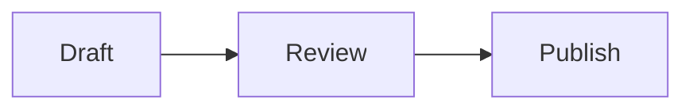

# LessonMark authoring guide

This guide describes LessonMark 0.3.0-alpha3 and its supported Markdown dialect. The
Markdown source remains the editable source of truth; rendered HTML is derived
for preview and student display.

## Basic structure

### Classroom presentation

Choose **Present this lesson** on a saved lesson to show one page at a time without
Moodle navigation. Separate pages with `<!-- slide -->` on its own line at
column zero. Example:

````markdown
# Today's topic

Explain the main idea briefly.

<!-- slide -->

# Worked example

```math
\frac{a}{b}
```
````

The same source appears continuously in normal study view. Structural markers
are omitted from the visible lesson and start a new page in browser printing
and **Download saved PDF**. Examples inside code fences remain ordinary text.
Keep each page's Markdown self-contained, including reference-link definitions.
Ordinary `---` horizontal rules do not split pages. No marker means one page.

Use Previous/Next or left/right keys; Home/End go to the first/last page.
Arrow keys keep their normal meaning inside inputs and controls. Long pages
scroll rather than shrinking text; split dense material into more pages.
Fullscreen requires browser support; **Return to lesson** remains available.
The fullscreen button reads **Exit fullscreen** while fullscreen is active.
In 0.3, **Present course lessons** continues through accessible LessonMark
activities in course order, with a lesson selector and shared fullscreen shell.
For now, navigate between slides with the controls, not cross-slide anchors.

Presentation is HTML rendered from saved source, not a PDF viewer. Saved PDF
export continues to retain math/diagram source rather than browser-rendered graphics.

Use ATX headings, paragraphs, emphasis, links, lists, blockquotes, inline code,
fenced code blocks, and tables. Keep one H1 for the document title where
practical and do not skip heading levels merely to obtain a visual size.

The source editor visually wraps long prose lines without adding line breaks to
the saved Markdown. Code blocks continue to preserve their source whitespace.

```markdown
# Python conditions

## Learning objective

Explain how `if` selects a branch.
```

LessonMark assigns stable IDs to headings. Duplicate headings receive `-2`,
`-3`, and so on. A table of contents is displayed when the document has two or
more headings. Changing a heading changes its generated link.

## Images

Upload teaching images in the **Teaching images** file manager, then reference
the exact uploaded path with LessonMark's canonical placeholder:

```markdown


```

The text inside `[]` is the alternative text. Describe the instructional
meaning of the image; Preview reports an empty or missing alternative text.
Decorative-image semantics are not inferred in the current dialect.

Moodle stores the images. LessonMark keeps `@@PLUGINFILE@@` in the Markdown
source and resolves it to a temporary draft URL in Preview or an
access-controlled module URL after save. Up to 50 Moodle `web_image` files are
accepted per activity, subfolders are supported, and site upload limits apply.

A relative reference such as `` does not upload or
search for a local file. Preview reports it as unresolved. Upload the image and
change the source to `@@PLUGINFILE@@/images/chart.png`. Markdown-and-images ZIP
bundle import is not supported.

## Import and export

Select **Import .md** to place an external Markdown file in the editor. The
file must:

- have a name ending in `.md`;
- contain valid UTF-8 text;
- remain within 512 KiB after BOM and line-ending normalisation.

A leading UTF-8 BOM is removed and Windows or classic Mac line endings become
LF. If the editor is not empty, LessonMark asks before replacing its content.
The imported text remains unsaved until the activity form is saved. Import
does not upload adjacent images or remain synchronized with the original file.

For an existing activity, **Export saved .md** downloads the Markdown source
currently stored in Moodle. Unsaved editor changes and image files are not
included. Save first when the download must contain the latest edit.

**Download saved PDF** produces a portable reading copy from the same saved
source. Moodle-managed teaching images are embedded, ANSWER disclosures are
expanded, and RESPONSE or CHOICE controls become blank printable working
areas. Each `<!-- slide -->` boundary starts a new PDF page. Browser-local
answers and unsaved editor changes are not included.
Remote images are not fetched into the PDF.

## Callouts

Use the portable blockquote form below. Names are case-insensitive.

```markdown
> [!NOTE]
> Background information.

> [!TIP]
> A practical suggestion.

> [!WARNING]
> A condition that can cause a problem.
```

Custom callout titles, nested callouts, and collapsible callouts are not part of
the current dialect.

## Self-check blocks

Self-check blocks keep a short practice cycle inside one LessonMark page. They
do not create Moodle quiz attempts, grades, submissions, or completion data.

Use `RESPONSE` for a free-text working answer:

```markdown
> [!RESPONSE]
> Explain your answer before opening the official answer.
```

Use `CHOICE` with a Markdown list for a single-choice working answer:

```markdown
> [!CHOICE]
> Select one answer.
>
> - A. First option
> - B. Second option
```

Place the official answer and explanation immediately after the response. The
content is rendered as a closed disclosure:

```markdown
> [!ANSWER]
> **Official answer: B**
>
> Explain why B follows from the source material.
```

Working answers are stored only in the current browser, scoped by Moodle user
and LessonMark activity. They are not available to teachers and do not move to
another browser or device. Learners can clear each saved answer. Use Moodle
Quiz or Assignment when grading, submission, attempt history, or teacher review
is required.

## Code

Add a language after the opening fence.

````markdown
```python
if score >= 60:
    print("pass")
```
````

The supported language identifiers are:

| Language | Identifiers |
| --- | --- |
| Plain text | `text`, `plain`, `plaintext` |
| Bash | `bash`, `sh`, `shell` |
| CSS | `css` |
| HTML/XML | `html`, `xml` |
| JavaScript | `javascript`, `js` |
| JSON | `json` |
| PHP | `php` |
| Python | `python`, `py` |
| SQL | `sql` |

An unknown identifier does not load code or a library dynamically. LessonMark
keeps the code readable as plain text and reports a preview diagnostic.

## Mathematics

Use a prefixed inline code span for a formula inside a sentence:

```markdown
The ratio is `math:\frac{a}{b}` and the beginner form is `asciimath:a/b`.
```

Use `math` or `latex` fenced blocks for displayed LaTeX, and `asciimath` for
displayed AsciiMath:

````markdown
```math
\frac{-b \pm \sqrt{b^2 - 4ac}}{2a}
```

```asciimath
sum_(i=1)^n i = (n(n+1))/2
```
````

LessonMark renders formulas locally with bundled assets and provides a Copy
LaTeX control. The saved Markdown is not replaced by the rendered formula. If
a formula is invalid, its original code remains visible.

**Copy LaTeX** copies LaTeX text, including the converted representation of an
AsciiMath formula. Paste it into a compatible math editor, or into a `math`
fence / `math:` inline code span in LessonMark. The button does not copy the
surrounding Markdown delimiters or change the original AsciiMath source.

The syntax is shared with Ozeki Markdown Documents. `math:` is the documented
LaTeX prefix; `latex:` is also accepted for source compatibility.

## Mermaid diagrams

Use a `mermaid` fenced block:

````markdown

````

LessonMark keeps this fence unchanged as the source of truth and renders it
locally in Preview and student view. Mermaid uses strict security, disables
HTML labels, and enforces text and edge limits. It is not downloaded on
student pages that do not contain a Mermaid fence.

If Mermaid rejects the diagram, LessonMark leaves the original fenced source
visible so that content is never silently lost. PDF export uses the same
readable source fallback because browser-generated SVG is not canonical data.

## Tables

```markdown
| Concept | Example |
| --- | --- |
| Equality | `x == 1` |
| Ordering | `x < 10` |
```

Wide tables receive a keyboard-focusable horizontal scroll region. Avoid using
a table for page layout and include a meaningful header row.

## Safety and current boundaries

Raw HTML is not an authoring feature. HTML-like input is displayed as text;
scripts, iframes, inline styles, and event attributes are not accepted. Use a
fenced code block when HTML is the subject of the lesson.

Preview and import do not save the Markdown source or publish uploaded draft
files. Save the activity to publish the current source and images. Preview and
student display call the same server-side rendering pipeline; syntax colour is
then applied in the browser without changing the stored source.
